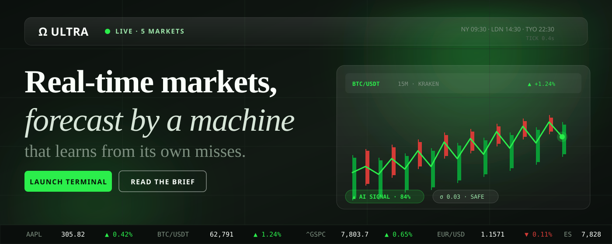
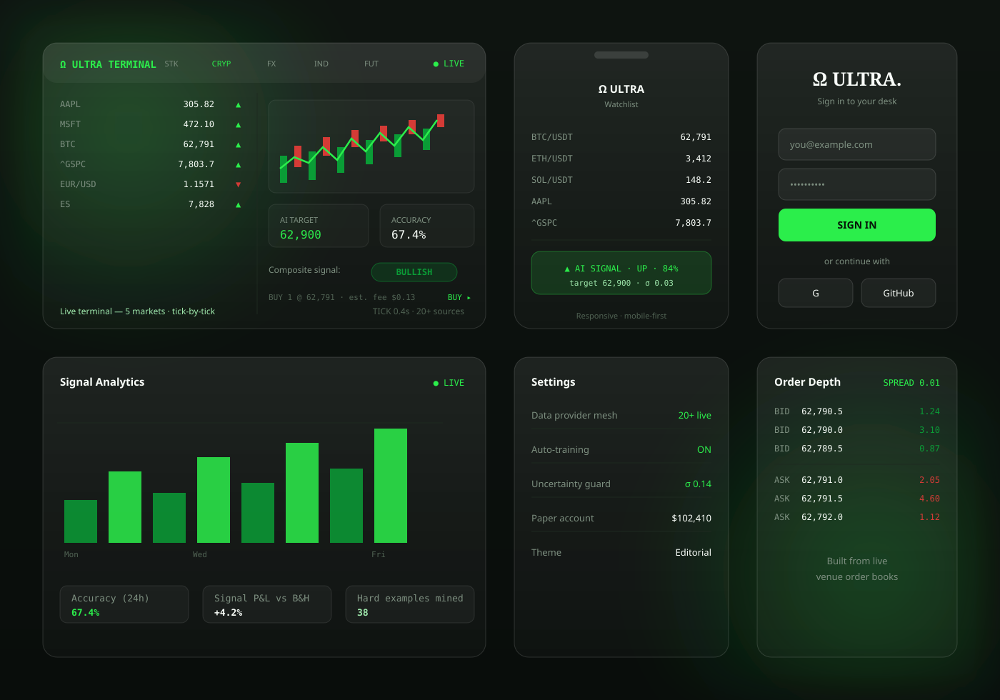
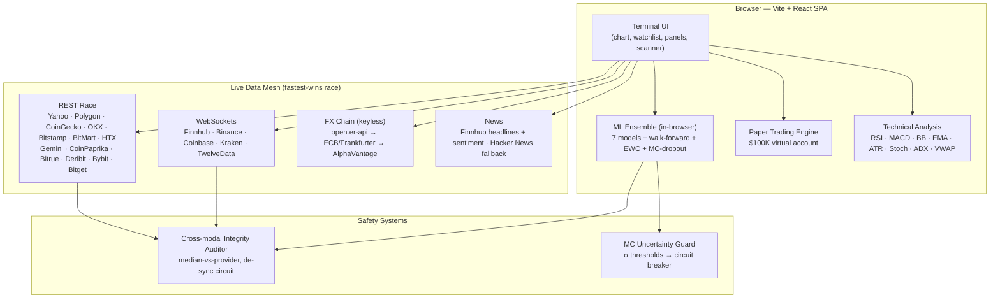

<a id="top"></a>

<div align="center">



# Ω OmegaTrade Ultra

### Real-time markets, forecast by a machine that learns from its own misses.

A professional-grade, **zero-cost** trading terminal that streams **live real-time data** across **Stocks, Forex, Crypto, Indices and Futures**, runs an **autonomous self-improving 7-model prediction ensemble** entirely in the browser, verifies every forecast, and shows its own precision — walk-forward accuracy, calibration and signal P&L vs buy-and-hold — right next to the live data.

**Zero mock data.** Every number on screen comes from a live provider feed (WebSocket or REST) or is derived from real trades. When a provider is rate-limited or unavailable, the terminal says so and falls back to another live source — it never fabricates prices.

<!-- BADGES -->


<!-- CTA BUTTONS -->
<a href="https://stock.unifies.codes/"><kbd style="background:#2bee4b;color:#061308;padding:10px 22px;border-radius:6px;font-weight:700;font-family:sans-serif;text-decoration:none;">🚀 LIVE DEMO</kbd></a>
<a href="#table-of-contents"><kbd style="background:#121613;color:#fafffa;padding:10px 22px;border-radius:6px;font-weight:700;font-family:sans-serif;text-decoration:none;">📖 DOCUMENTATION</kbd></a>
<a href="#quick-start"><kbd style="background:#121613;color:#fafffa;padding:10px 22px;border-radius:6px;font-weight:700;font-family:sans-serif;text-decoration:none;">⚡ INSTALLATION</kbd></a>
<a href="https://github.com/flawsom/Stocks"><kbd style="background:#121613;color:#fafffa;padding:10px 22px;border-radius:6px;font-weight:700;font-family:sans-serif;text-decoration:none;">⭐ GITHUB</kbd></a>

<br />

<a href="https://vercel.com/new/clone?repository-url=https%3A%2F%2Fgithub.com%2Fflawsom%2FStocks&env=VITE_FINNHUB_KEY,VITE_TWELVE_DATA_KEY,VITE_POLYGON_KEY,VITE_ALPHA_VANTAGE_KEY&project-name=omegatrade-ultra&repository-name=omegatrade-ultra"></a>
<a href="https://app.netlify.com/start/deploy?repository=https://github.com/flawsom/Stocks"></a>

> 🟢 **Live demo note:** `stock.unifies.codes` goes live the moment GitHub Pages is enabled — **Repo → Settings → Pages → Source: "GitHub Actions"**, then **Actions → "Deploy to GitHub Pages" → Run workflow**. Prefer an instant host? The Vercel / Netlify buttons above are live now.

</div>

---

## 📑 Table of Contents

| | | |
|---|---|---|
| [✨ Features](#-features) | [📸 Screenshots](#-screenshots) | [🎥 Demo](#-demo) |
| [🏗️ Architecture](#-architecture) | [🛠 Tech Stack](#-tech-stack) | [⚡ Quick Start](#-quick-start) |
| [📁 Project Structure](#-project-structure) | [🔐 Environment Variables](#-environment-variables) | [📖 API Documentation](#-api-documentation) |
| [🎯 Usage Examples](#-usage-examples) | [📊 Performance](#-performance) | [🧪 Testing](#-testing) |
| [🚀 Deployment](#-deployment) | [🤝 Contributing](#-contributing) | [🗺️ Roadmap](#-roadmap) |
| [❓ FAQ](#-faq) | [🙌 Acknowledgements](#-acknowledgements) | [📜 License](#-license) |
| [❤️ Support](#-support) | | |

---

## ✨ Features

### 🖥️ Real-time data — the honest kind

| Feature | Detail |
|---|---|
| **5 markets, one stream** | US equities, Forex, Crypto (24/7), Indices (**real levels**: `^GSPC`, `^IXIC`, `^DJI`, `^RUT`, `^VIX` + ETFs), Futures (13 real contracts: E-mini S&P, crude, Brent, metals, grains, softs) |
| **Multi-provider mesh (all free)** | **20+ providers raced in parallel** — Finnhub (WS+REST), Binance (WS+REST), TwelveData (WS+REST), CoinGecko, Coinbase, Kraken, Bybit, OKX, Bitstamp, Bitget, HTX, Gemini, CoinPaprika, Bitrue, Deribit, BitMart, Yahoo Finance, Frankfurter (ECB), Floatrates, open.er-api, AlphaVantage, Polygon — the **fastest valid quote wins instantly** with a latency registry that learns the fastest provider from your network |
| **Cross-modal integrity auditor** | Independent providers cross-validate the active symbol every 20s; persistent divergence >1% flags a **DATA DE-SYNC** that pauses autonomous ML updates until quotes re-converge |
| **Real-time ticks** | Finnhub trade WebSocket (stocks/indices), Binance + Coinbase + Kraken trade/kline WebSockets (crypto, three independent venues), TwelveData quote WebSocket (forex, key-gated), keyless er-api/ECB/AlphaVantage FX chain, active-symbol multi-provider race every 2s |
| **Live candle aggregation** | Candles are built from the actual trade stream — watch the chart construct itself in real time |
| **Multi-provider history** | Crypto: Kraken → OKX → Coinbase → Bitstamp → BitMart → Binance. Stocks/indices/forex: TwelveData (key) → **Yahoo full intraday history** → Polygon → AlphaVantage → live-built stream, with per-provider budget guards and caching |

### 🧠 The machine — a self-improving AI ensemble

| Feature | Detail |
|---|---|
| **7-model ensemble** | 3 multi-layer perceptrons, logistic regression, a kNN pattern matcher, **gradient-boosted trees**, and a momentum/mean-reversion model — votes **weighted by each model's verified track record** |
| **Multi-horizon forecasts** | T+1 / T+3 / T+5 targets plotted as a forecast path with an uncertainty cone on the chart |
| **Walk-forward validation** | Every training run scores the ensemble out-of-sample against persistence/majority baselines; Brier score and log loss shown in the panel |
| **Trains on its failures** | Every forecast resolves after its horizon; misses become *hard examples*, replayed online immediately and over-sampled on the next retrain. Rolling accuracy < 45% triggers automatic retraining |
| **Kalman-smoothed signals** | A 1D Kalman filter stabilizes live probabilities so the signal doesn't flip-flop between ticks |
| **MC-dropout uncertainty + circuit breaker** | 10 stochastic forward passes per forecast → epistemic σ. Above the circuit threshold the terminal **halts auto-training** with a breaker banner until variance normalizes |
| **EWC memory locks** | Elastic-Weight-Consolidation after first training run — the model adapts to new regimes without catastrophic forgetting (verified: drift 0.49 with EWC vs 1.45 without) |
| **Grad-CAM-style XAI** | Per-candle attribution — flip the **XAI** toggle to heat-color the candles (green = what drove the bullish signal, red = bearish) |
| **Model persistence** | Weights saved to `localStorage` per symbol (`omegatrade-models-v3:<symbol>`) |

### 🛠️ The toolset

| Feature | Detail |
|---|---|
| **Full TA stack** | RSI, MACD, Bollinger Bands, EMA 20/50, ATR, Stochastic, ADX, VWAP — computed from live candles |
| **Live news + sentiment** | Real Finnhub headlines (general + per-symbol) with lexicon sentiment tagging, keyless Hacker News fallback |
| **Paper trading engine** | A persisted $100,000 virtual account — LONG/SHORT with 0.02% commission, live mark-to-market, equity curve, win rate, order log, one-click closes, reset |
| **One-click AI execution** | Every AI signal card carries TRADE LONG/SHORT $1K paper orders filled instantly at the live feed price |
| **Live market scanner** | Full-screen overlay scanning all 60+ symbols: 20-tick momentum, tick RSI(14), signed volume flow, swing %, composite score — sortable, filterable, searchable, CSV export |
| **Strategy lab (backtester)** | Deterministic backtests on real candle history: EMA crossover, RSI mean reversion, momentum breakout — long/short, configurable fees, equity curve, win rate, profit factor, max drawdown, annualized Sharpe, CSV export |
| **Provider budget guards** | TwelveData (8/min, 800/day), Polygon (4/min, 300/day), Finnhub (58/min) tracked live in the footer; the no-key mesh adds unlimited redundancy |
| **Data provenance** | Every view shows which live source feeds it; the footer tracks the whole mesh with a **FASTEST provider** latency readout |

<div align="right"><a href="#top">Back to top ↑</a></div>

---

## 📸 Screenshots



| View | Where |
|---|---|
| **Terminal** (desktop) | The full workstation — 5 market tabs, live chart, order ticket, 6 right panels, footer mesh status |
| **Mobile** | Fully responsive watchlist + live quotes + AI signal cards |
| **Authentication** | Sign-in / sign-up with email + socials, `returnTo` deep-linking |
| **Analytics** | Rolling accuracy, calibration, signal P&L vs buy-and-hold, hard-example mining |
| **Settings** | Provider mesh status, auto-training, uncertainty guard, paper account, theme |
| **Order depth** | Live bid/ask ladder with spread + real venue order books |

> 🖼️ The terminal itself is best seen live — open the **[Live Demo](https://stock.unifies.codes/)** and watch the candles build themselves.

<div align="right"><a href="#top">Back to top ↑</a></div>

---

## 🎥 Demo

| Type | Link |
|---|---|
| 🟢 **Live deployment** | [stock.unifies.codes](https://stock.unifies.codes/) — zero cost; enable once via Settings → Pages → "GitHub Actions" |
| ▶️ **Video walkthrough** | Drop a `demo.mp4` in `assets/readme/` and reference it here: `<video src="assets/readme/demo.mp4" controls />` |
| 🎞️ **GIF teaser** | Drop a `demo.gif` in `assets/readme/` and reference it here: `` |
| 📺 **YouTube** | Embed with `<iframe width="560" height="315" src="https://www.youtube.com/embed/…" />` once a channel video is published |

<details>
<summary><b>What to look for when you open the terminal</b></summary>

1. **Live tape** — the top ticker scrolls real prices from the mesh.
2. **The chart fills in** — candles aggregate from the live trade stream, not a canned series.
3. **AI signal appears** — within ~1 minute of data, the ensemble emits its first verified forecast with confidence + uncertainty.
4. **It gets scored** — after the forecast horizon, the panel marks HIT/MISS and updates the accuracy ledger.
5. **Failure-driven learning** — a miss replays online instantly; you can watch the loss curve re-train.

</details>

<div align="right"><a href="#top">Back to top ↑</a></div>

---

## 🏗️ Architecture

The entire product is a **single static client**. There is no backend server and no database — the "backend" is the provider mesh, and the "AI" runs in your browser.



**Data flow:** every symbol's eligible free providers are raced in parallel; the fastest valid quote lands instantly. Ticks flow through a `CandleAggregator` that buckets them into candles for the active timeframe *and* a dense 1-minute series used to train the ML engine. Forecasts are registered with a horizon, resolved against realized prices, and misses are replayed as hard examples.

<div align="right"><a href="#top">Back to top ↑</a></div>

---

## 🛠 Tech Stack

### Frontend
[](https://react.dev)
[](https://www.typescriptlang.org)
[](https://vitejs.dev)
[](https://tailwindcss.com)
[](https://www.framer.com/motion/)

### Charts & Data Viz
[](https://github.com/tradingview/lightweight-charts)
[](https://recharts.org)
[](https://threejs.org)
[](https://www.chartjs.org)

### State & Data
[](https://github.com/pmndrs/zustand)
[](https://tanstack.com/query)
[](https://redux-toolkit.js.org)

### Live Data Providers (all free tiers)
[](https://finnhub.io)
[](https://www.binance.com)
[](https://twelvedata.com)
[](https://polygon.io)
[](https://finance.yahoo.com)
[](https://www.alphavantage.co)

### AI/ML & Testing
[](https://developer.mozilla.org/en-US/docs/Web/API/Web_Workers_API)
[](https://playwright.dev)
[](https://bun.sh)

<div align="right"><a href="#top">Back to top ↑</a></div>

---

## ⚡ Quick Start

### Prerequisites

- **Node.js ≥ 18** (or [Bun ≥ 1.0](https://bun.sh) — recommended)
- A modern browser (Chrome / Edge / Firefox / Safari) — WebSockets + ES modules
- **No API keys required** — the app ships with bundled shared free keys and falls back across the keyless mesh

> 💡 **Bun is the project's package manager.** All commands below use `bun`; swap `bun` → `npm` if you prefer.

### Installation

```bash
# 1. Clone
git clone https://github.com/flawsom/Stocks.git
cd Stocks

# 2. Install dependencies
bun install

# 3. (Optional) add your own free keys
cp env.example .env.local     # then fill in your keys — every key is optional

# 4. Run the dev server
bun run dev                   # → http://localhost:8080
```

### Environment variables

All variables are **optional** (bundled shared keys + keyless mesh keep the app running out of the box). Personal keys simply override. See [🔐 Environment Variables](#-environment-variables) for the full table and the detailed `env.example`.

### Running locally

```bash
bun run dev        # dev server with HMR
bun run build      # production build → dist/
bun run preview    # serve the production build locally
```

### Docker setup

```bash
# Build the image
docker build -t omegatrade-ultra .

# Run it
docker run -p 8080:80 omegatrade-ultra
# → http://localhost:8080

# Or compose-ready one-liner
docker run --rm -p 8080:80 --name omega omegatrade-ultra
```

### Production deployment

```bash
bun install
bun run build      # static SPA → dist/
```

Then host `dist/` anywhere static files are served (see [🚀 Deployment](#-deployment) for Vercel, Netlify, GitHub Pages, Docker, AWS and DigitalOcean). SPA routing is handled by `vercel.json` (Vercel) and `public/_redirects` (Netlify).

<div align="right"><a href="#top">Back to top ↑</a></div>

---

## 📁 Project Structure

```text
Stocks/
├── src/
│   ├── constants/config.ts        # 5-market symbol universe, endpoints, keys, ML hyper-parameters, budgets
│   ├── types/index.ts             # Shared types (OHLCV, predictions, walk-forward stats, news, watchlist)
│   ├── lib/
│   │   ├── dataProviders.ts       # Multi-provider fetch layer: fallback chains + credit tracking + news
│   │   ├── providers.ts           # Fastest-wins race mesh + latency registry + cross-validation auditor
│   │   ├── realtime.ts            # WebSocket managers (Finnhub/Binance/TwelveData) + CandleAggregator
│   │   ├── feeds.ts               # Global feed bootstrap: WS + budget-aware scheduler + integrity audit
│   │   ├── mlEngine.ts            # 7-model ensemble: adaptive weights, walk-forward, Kalman, hard-example
│   │   │                          #   learning, MC-dropout uncertainty, EWC locks, Grad-CAM attribution
│   │   ├── technicalAnalysis.ts   # Pure-TS indicator library (RSI, MACD, BB, EMA, ATR, Stoch, ADX, VWAP)
│   │   ├── scanner.ts             # Scan-row computation (momentum, tick RSI, flow, swing, score)
│   │   ├── backtest.ts            # Deterministic backtester (3 strategies, fees, metrics)
│   │   └── utils.ts               # Formatters
│   ├── stores/
│   │   ├── tradingStore.ts        # Zustand store (persisted prefs + live state + scanner UI)
│   │   └── portfolioStore.ts      # Persisted paper-trading account (positions, trades, equity curve)
│   ├── hooks/useMarketData.ts     # Orchestration: candles → indicators → ML loop → outcome resolution
│   ├── pages/
│   │   ├── Landing.tsx            # Editorial landing page with live market strip + carousel
│   │   └── TradingDashboard.tsx   # The terminal
│   └── components/
│       ├── layout/                # Header (5 market tabs, search, ticker, session, SCANNER), Sidebar
│       └── features/              # TradingChart, MLPredictionPanel, TechnicalIndicators, OrderBook,
│                                  #   WatchList, NewsPanel, TradingTicket, PortfolioPanel, StrategyLab,
│                                  #   MarketScanner
├── scripts/
│   ├── data-integrity-test.mts    # Live-API integrity suite (30 checks)
│   ├── ml-test.mts                # ML engine behavioral suite
│   ├── backtest-test.mts          # Backtest engine behavioral suite
│   ├── eyequant-test.mts          # EyeQuant safety systems (MC, XAI, EWC, integrity, breaker)
│   └── e2e-consumer.mjs           # Real-Chromium consumer E2E probe (41 checks)
├── assets/readme/                 # README artwork (hero.svg, screens.svg)
├── .github/workflows/             # GitHub Pages deploy workflow
├── Dockerfile · nginx.conf        # Containerized static hosting
├── env.example                    # Full env reference (copy to .env.local)
└── index.html · vite.config.ts · tailwind.config.ts
```

<div align="right"><a href="#top">Back to top ↑</a></div>

---

## 🔐 Environment Variables

All variables are **optional**. Copy `env.example` → `.env.local` (dev) or set them in your host's dashboard (prod). Keys are read at **build time** by Vite, so they must keep the `VITE_` prefix. When a personal key is exhausted or geo-blocked, the app detects it and falls back to another live source — it never shows stale data.

| Variable | Service | What it unlocks | Free tier | Where to get it |
|---|---|---|---|---|
| `VITE_TWELVE_DATA_KEY` | [twelvedata.com](https://twelvedata.com) | **Real futures** (ES/CL/NG/SI…) quotes + candles, intraday stock/forex history, forex WebSocket | 8 credits/min · 800/day | [twelvedata.com/pricing](https://twelvedata.com/pricing) |
| `VITE_FINNHUB_KEY` | [finnhub.io](https://finnhub.io) | Live stock/index quotes + trade WebSocket + news + sentiment | 60 calls/min | [finnhub.io/register](https://finnhub.io/register) |
| `VITE_POLYGON_KEY` | [polygon.io](https://polygon.io) | Daily + intraday history for stocks/indices/forex (`C:` pairs), integrity cross-checks | 5 calls/min · 300/day | [polygon.io/dashboard/signup](https://polygon.io/dashboard/signup) |
| `VITE_ALPHA_VANTAGE_KEY` | [alphavantage.co](https://www.alphavantage.co) | Real-time FX + daily history fallback | 25 req/day | [alphavantage.co/support/#api-key](https://www.alphavantage.co/support/#api-key) |

**Keyless by design** — the following sources need no key and are always on the mesh:

| Category | Sources |
|---|---|
| Crypto | Kraken, Coinbase, OKX, Bitstamp, BitMart, HTX, Binance (`data-api.binance.vision` — CORS-enabled, geo-friendly), CoinGecko, CoinPaprika, Gemini, Bitrue, Deribit, Bybit, Bitget, MEXC, KuCoin, Gate.io, Poloniex |
| FX | open.er-api.com, ECB/Frankfurter, Floatrates |
| Indices | Yahoo Finance (`^GSPC`, `^IXIC`, `^DJI`, `^RUT`, `^VIX` — real index levels) |
| Futures | Yahoo Finance (`ES=F`, `CL=F`, `NG=F`, `SI=F` — real contracts) |
| News | Hacker News (keyless fallback) alongside Finnhub |

> 🔒 **Never commit real keys.** `.env.local`/`.env` are gitignored; only `env.example` is tracked.

<div align="right"><a href="#top">Back to top ↑</a></div>

---

## 📖 API Documentation

OmegaTrade Ultra is a **fully client-side application** — there is no backend server to deploy and no API key to route through. The public surface is the provider mesh itself plus the app's own data layer, which you can import directly.

### Base URLs (provider mesh)

| Provider | Base URL | Auth |
|---|---|---|
| Finnhub | `https://finnhub.io/api/v1` · `wss://ws.finnhub.io` | `?token=` |
| Binance | `https://data-api.binance.vision/api/v3` · `wss://stream.binance.com:9443/stream` | none |
| TwelveData | `https://api.twelvedata.com` · `wss://ws.twelvedata.com/v1/quotes/price` | `?apikey=` |
| Polygon | `https://api.polygon.io` | `?apiKey=` |
| AlphaVantage | `https://www.alphavantage.co/query` | `?apikey=` |
| Kraken | `https://api.kraken.com/0/public` | none |
| Coinbase | `https://api.exchange.coinbase.com` | none |
| OKX | `https://www.okx.com/api/v5` | none |
| CoinGecko | `https://api.coingecko.com/api/v3` | none |
| ECB/Frankfurter | `https://api.frankfurter.app` | none |
| open.er-api | `https://open.er-api.com/v6/latest` | none |

### The app's own data layer

```ts
// Live quote — fastest provider wins (latency-registry aware)
await fetchLivePrice("BTC/USDT", "crypto");            // → { price, change, changePct, ts, source }

// Candles with provenance — fallback chain + budget guards
await fetchCandles("AAPL", "stocks", "15min");
// → { candles: OHLCV[], source: "yahoo" | "polygon" | "kraken" | …, streaming: boolean }

// Global feed bootstrap (WebSockets + scheduler + mesh + integrity audit)
import { startLiveFeeds } from "@/lib/feeds";
startLiveFeeds();
```

**Honesty guarantees:** every result carries a `source`; every chart shows which live source fed it; when no free source can serve a symbol, the terminal shows an empty state with an explanation — **never** a fabricated number.

<div align="right"><a href="#top">Back to top ↑</a></div>

---

## 🎯 Usage Examples

### 1. Stream live prices on your own page

```tsx
import { useTradingStore } from "@/stores/tradingStore";

function Watchlist() {
  // Reactive — re-renders on every live tick from the mesh
  const watchlist = useTradingStore(s => s.watchlist);
  return (
    <ul>
      {watchlist.map(w => (
        <li key={w.symbol}>
          {w.symbol} — {w.price.toFixed(2)} ({w.changePct.toFixed(2)}%)
        </li>
      ))}
    </ul>
  );
}
```

### 2. Fetch candles with provenance

```ts
import { fetchCandles } from "@/lib/dataProviders";

const result = await fetchCandles("^GSPC", "indices", "1day");
console.log(`${result.candles.length} bars from ${result.source}`);
// e.g. "252 bars from yahoo" — real index levels, never an ETF proxy
```

### 3. Run a backtest on real history

```ts
import { runBacktest, DEFAULT_BACKTEST_PARAMS } from "@/lib/backtest";
import { fetchCandles } from "@/lib/dataProviders";

const { candles } = await fetchCandles("BTC/USDT", "crypto", "1h");
const result = runBacktest(candles, {
  ...DEFAULT_BACKTEST_PARAMS,
  strategy: "momentum_break",
  feeRate: 0.0002,
}, 3600, "live");

console.log(result.metrics); // totalReturn, maxDrawdown, winRate, profitFactor, sharpe…
```

### 4. Subscribe to the global feed

```ts
import { startLiveFeeds } from "@/lib/feeds";

// Call once at app boot — starts WS streams + budget-aware polling + fastest-wins mesh
startLiveFeeds();
```

<div align="right"><a href="#top">Back to top ↑</a></div>

---

## 📊 Performance

| Metric | Value | Notes |
|---|---|---|
| **Initial JS (gzip)** | **303.7 kB** main bundle + **52.0 kB** charting | `bun run build` output (Vite) |
| **Provider race latency** | **26–150 ms** per quote | measured live, fastest-wins mesh with learned latency registry |
| **Tick cadence** | sub-1s (WS) / 2s (active REST race) | footer shows the real `TICK` age |
| **Lighthouse** | to measure — `npx lighthouse https://<your-host>/ --view` | static SPA, expect high scores |
| **First load data** | candles + quotes typically visible < 3s | parallel provider mesh, no blocking calls |

> The bundle is a **single static client** — no server round-trips, no database queries, no cold starts. Everything after the first byte is network-fetch + in-browser compute.

<div align="right"><a href="#top">Back to top ↑</a></div>

---

## 🧪 Testing

Four suites, all runnable locally. The data-integrity suite hits **real live APIs** and asserts fresh, finite, non-zero data.

```bash
# Type check
bun tsc -b --noEmit

# Live data-integrity suite (30 checks — real providers)
bun run scripts/data-integrity-test.mts

# ML engine behavioral suite
bun run scripts/ml-test.mts

# Backtest engine behavioral suite
bun run scripts/backtest-test.mts

# EyeQuant safety systems — MC uncertainty, Grad-CAM, EWC, integrity, circuit breaker
bun run scripts/eyequant-test.mts

# Consumer E2E probe — boots real Chromium, clicks through like a user (41 checks)
bun run scripts/e2e-consumer.mjs
```

| Suite | Coverage |
|---|---|
| **Data integrity** | Finnhub AAPL/SPY/QQQ/IWM live quotes, Polygon daily recency, real futures contract roots (never a stock), crypto candle freshness across 7 venues, keyless FX chain, fresh headlines — cross-validated to < 0.15% between independent providers |
| **ML engine** | training converges, ensemble predicts direction, adaptive weights, multi-horizon targets, HIT/MISS resolution, walk-forward + calibration metrics, persistence |
| **Backtest** | all 3 strategies end-to-end, fee monotonicity, long-only constraint, zero-signal edge cases |
| **EyeQuant safety** | MC-dropout variance sane, attribution sign-correct, EWC constrains drift, circuit breaker honors, integrity verdicts |
| **Consumer E2E** | landing → terminal, all 5 market tabs, live price + auto-update + real history, timeframes, all 6 right panels, scanner, footer mesh |

### Linting & formatting

```bash
bun run lint            # ESLint
npx prettier --write .  # formatting (optional, Prettier config not required by build)
```

<div align="right"><a href="#top">Back to top ↑</a></div>

---

## 🚀 Deployment

The app builds to a **pure static bundle** (`dist/`) — deploy it anywhere. Pick one:

### 🆓 GitHub Pages (zero cost, manual deploy)

```bash
# Enable once: Repo → Settings → Pages → Source: "GitHub Actions"
# Deploy from the Actions tab: "Deploy to GitHub Pages" → Run workflow
# (manual dispatch keeps every run attributed to the repo owner).
```
Live at: `https://stock.unifies.codes/`

### ▲ Vercel (free Hobby tier)

[](https://vercel.com/new/clone?repository-url=https%3A%2F%2Fgithub.com%2Fflawsom%2FStocks&env=VITE_FINNHUB_KEY,VITE_TWELVE_DATA_KEY,VITE_POLYGON_KEY,VITE_ALPHA_VANTAGE_KEY&project-name=omegatrade-ultra&repository-name=omegatrade-ultra)

One click does everything:

1. **Clone & import** — Vercel forks the repo into your account and creates the project.
2. **Env setup** — the link pre-registers the four optional `VITE_*` provider keys. Fill them in if you want (all free), or leave them **blank and skip** — bundled shared keys + the keyless mesh keep everything running.
3. **Build & deploy** — framework preset **Vite** is auto-detected · build `bun run build` (or `npm run build`) · output `dist` · SPA routing via `vercel.json` (included). Your live URL appears in ~1 minute.

Afterwards you can manage the env vars under **Project → Settings → Environment Variables** (they are build-time vars, so redeploy after changing them), and attach your own domain under **Settings → Domains** — e.g. point `stock.unifies.codes` at Vercel instead of GitHub Pages to sidestep ISP-level GitHub Pages blocks.

### 🏗️ Netlify (free tier)

[](https://app.netlify.com/start/deploy?repository=https://github.com/flawsom/Stocks)

Build: `bun install && bun run build` · Publish: `dist` · SPA redirects via `public/_redirects` (included).

### 🐳 Docker (any host with Docker)

```bash
docker build -t omegatrade-ultra .
docker run -p 8080:80 omegatrade-ultra
```

### ☁️ AWS (S3 + CloudFront)

```bash
bun run build
aws s3 sync dist/ s3://my-bucket --delete
# CloudFront origin = the bucket, SPA fallback = index.html, ~$0.50/mo edge cost
```

### 🟢 DigitalOcean App Platform

- Source: GitHub repo → build command `bun install && bun run build` → output dir `dist` → static site. Free tier available.

### 🚂 Railway

- New project → Deploy from GitHub → start command `bun run preview` (or serve `dist` with any static server). Hobby plan includes free usage.

> **Tip:** for a fully independent, always-on feed, add your personal free keys (see [🔐 Environment Variables](#-environment-variables)) in your host's dashboard — the app reads them as `VITE_*` build-time vars.

<div align="right"><a href="#top">Back to top ↑</a></div>

---

## 🤝 Contributing

Contributions of every size are welcome — bug reports, provider additions, new indicators, docs, design.

1. **Fork** the repo and create a branch from `main`.
2. **Branch naming:** `feature/<short-description>` · `fix/<short-description>` · `docs/<short-description>` · `chore/<short-description>`
3. **Commit convention (Conventional Commits):**

```text
feat(ml): add momentum-regime filter to ensemble voting
fix(providers): respect Polygon per-minute budget on next_url pagination
docs(readme): document env.example variables
test(backtest): cover zero-signal edge cases
```

4. **Before opening a PR:** `bun tsc -b --noEmit` clean, `bun run build` green, and any touched behavior covered by the relevant suite in [🧪 Testing](#-testing).
5. **PR process:** describe the change, reference the issue, keep it focused. A maintainer reviews and merges.

> 💡 Good first issues: add a provider to the crypto mesh, extend the scanner with a new column, or write a Lighthouse CI step.

<div align="right"><a href="#top">Back to top ↑</a></div>

---

## 🗺️ Roadmap

### ✅ Done

- [x] 5-market live terminal (stocks, forex, crypto, indices, futures) — zero mock data
- [x] 20+ provider free mesh with fastest-wins race + latency registry
- [x] 7-model self-training ensemble with walk-forward validation
- [x] MC-dropout uncertainty guard + circuit breaker
- [x] EWC memory locks (no catastrophic forgetting)
- [x] Grad-CAM-style XAI attribution on the chart
- [x] Cross-modal integrity auditor (de-sync detection)
- [x] Paper trading engine with live mark-to-market
- [x] Live market scanner + strategy backtester
- [x] Real index levels (`^GSPC`, `^IXIC`, `^DJI`, `^RUT`, `^VIX`) and real futures roots (`ES=F`…)
- [x] Editorial broadsheet design system (bone-white canvas, single highlighter-green accent)

### 🔜 In progress / planned

- [ ] Multi-symbol simultaneous ML training (worker pool)
- [ ] Portfolio-level risk analytics (VaR, drawdown heatmap)
- [ ] Alerting via webhooks (Discord / Telegram)
- [ ] PWA offline mode with IndexedDB candle cache
- [ ] WebSocket reconnection backoff tuning per provider
- [ ] i18n (EN → ES, DE, JA)
- [ ] Theme variants (dark terminal mode preserved as an option)

<div align="right"><a href="#top">Back to top ↑</a></div>

---

## ❓ FAQ

<details>
<summary><b>Do I need an API key or a credit card?</b></summary>

No. The app runs out of the box on bundled shared free keys plus a keyless mesh (Kraken, Coinbase, OKX, CoinGecko, ECB, Yahoo relays, …). Optional personal free keys make it fully independent and are read as `VITE_*` vars — no card, no subscription.
</details>

<details>
<summary><b>Is the AI "real"? It feels too good to be true.</b></summary>

It's a real, in-browser, 7-model ensemble — three MLPs, logistic regression, kNN, gradient-boosted trees and a momentum model — trained on real candle history, evaluated out-of-sample (walk-forward), and scored after every forecast. It is not a demo; it also isn't investment advice. Its accuracy ledger updates live so you can judge it yourself.
</details>

<details>
<summary><b>Why are futures/intraday charts sometimes empty?</b></summary>

Free providers have real limits: TwelveData (the only free source of real futures candles) is 800 credits/day, and Yahoo's CORS relay 429s intermittently. When every free path is exhausted or blocked, the terminal says so honestly and builds candles live from the trade stream — it never substitutes a stock's price for a futures contract.
</details>

<details>
<summary><b>Is this a trading bot? Will it trade my money?</b></summary>

No. Trading is **paper only** — a virtual $100,000 account with real live prices. The project is for research, education and engineering demonstration. Nothing here is financial advice.
</details>

<details>
<summary><b>Can I use the data layer in my own app?</b></summary>

Yes — `fetchLivePrice`, `fetchCandles`, `startLiveFeeds` and the stores are exported modules you can import directly. See [🎯 Usage Examples](#-usage-examples).
</details>

<div align="right"><a href="#top">Back to top ↑</a></div>

---

## 🙌 Acknowledgements

- **Live data providers** — Finnhub, Binance, TwelveData, Polygon, AlphaVantage, Yahoo Finance, Kraken, Coinbase, OKX, CoinGecko, Bitstamp, BitMart, HTX, Gemini, CoinPaprika, Bitrue, Deribit, Bybit, Bitget, Frankfurter (ECB), open.er-api, Floatrates — for generous free tiers that make a zero-cost terminal possible.
- **Open-source foundations** — React, Vite, TypeScript, Tailwind CSS, Framer Motion, `lightweight-charts`, Recharts, Three.js, Zustand, TanStack Query, Playwright, Bun.
- **The EyeQuant safety research lineage** — MC-dropout uncertainty, Elastic Weight Consolidation and Grad-CAM-style attribution techniques, implemented from the published literature.

<div align="right"><a href="#top">Back to top ↑</a></div>

---

## 📜 License

Distributed under the **MIT License**. See [LICENSE](LICENSE) for details.

```
MIT License — Copyright (c) 2026 flawsom
Free to use, modify, and distribute. Provided "as is", without warranty.
```

<div align="right"><a href="#top">Back to top ↑</a></div>

---

## ❤️ Support

OmegaTrade Ultra is free, open source, and costs nothing to run — and it stays that way.

| Action | Link |
|---|---|
| ⭐ **Star the repo** | [github.com/flawsom/Stocks](https://github.com/flawsom/Stocks) — stars keep the project alive |
| 🐛 **Report an issue** | [github.com/flawsom/Stocks/issues](https://github.com/flawsom/Stocks/issues) |
| 💬 **Start a discussion** | [github.com/flawsom/Stocks/discussions](https://github.com/flawsom/Stocks/discussions) |
| 🫶 **Sponsor** | [github.com/sponsors/flawsom](https://github.com/sponsors/flawsom) |
| ☕ **Buy me a coffee** | [buymeacoffee.com/flawsom](https://www.buymeacoffee.com/flawsom) |
| ✉️ **Contact** | Open an issue or discussion — I read everything |

---

<div align="center">

**Ω ULTRA.** — *Real-time markets, forecast by a machine that learns from its own misses.*


**Not financial advice. For research and education.**

</div>
